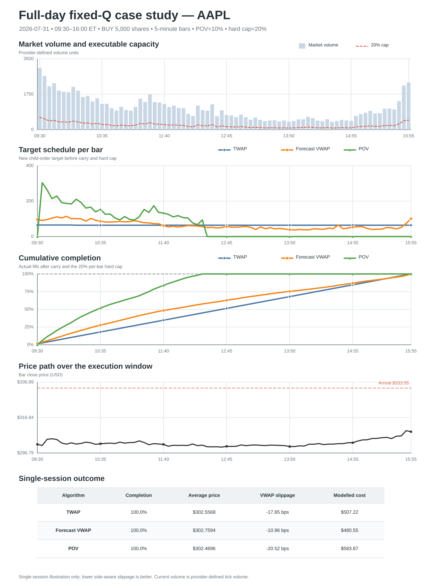
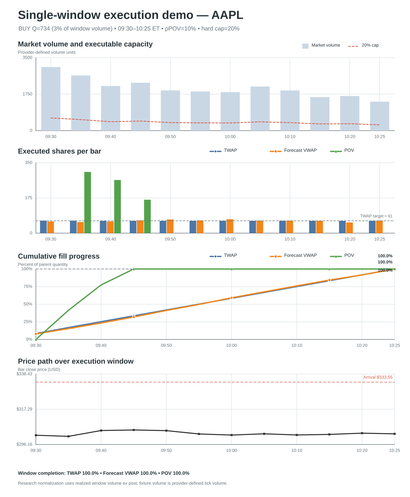
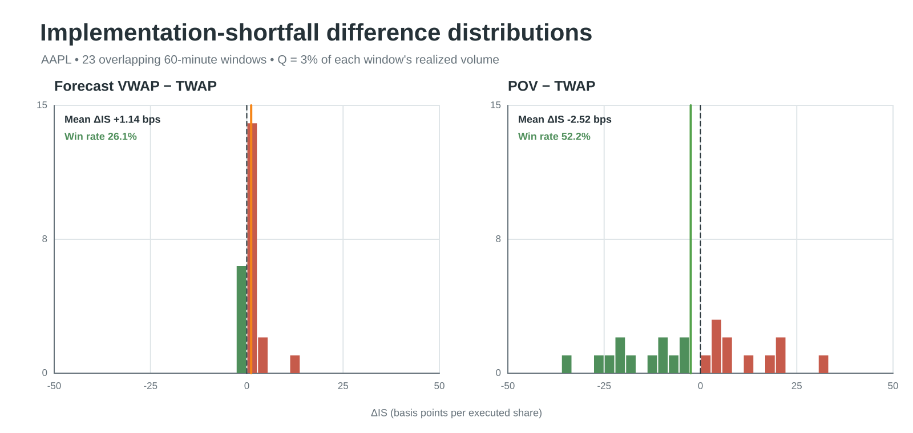
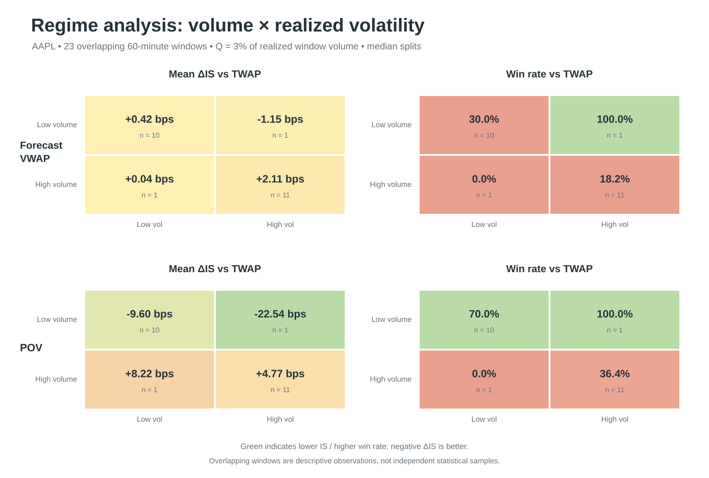
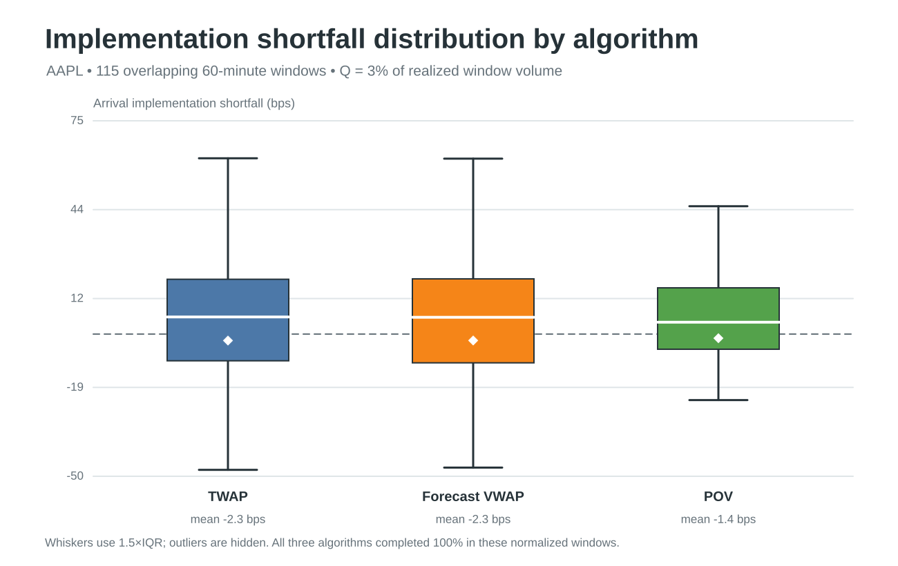
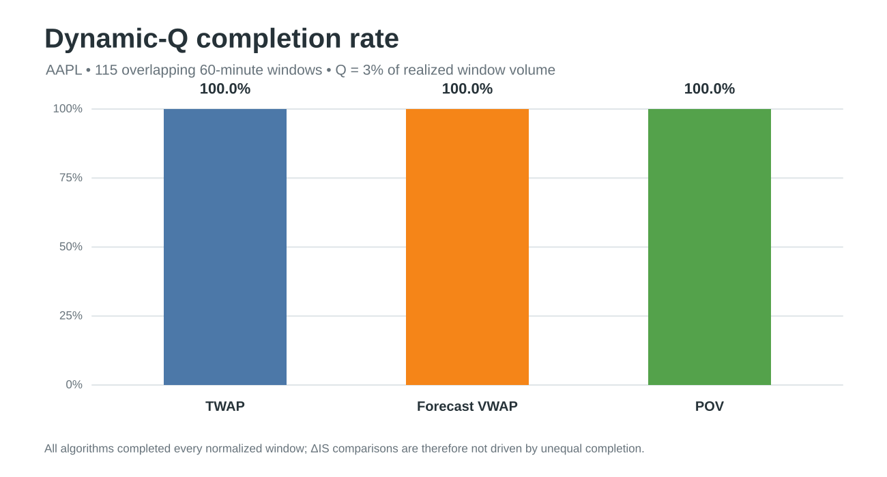

# TWAP_vs_VWAP_vs_POV

## 执行节奏与成本比较

本项目比较三种常见母订单拆分算法：**TWAP** 按时间均匀执行，**Forecast VWAP** 按交易前预测的日内成交量曲线执行，**POV** 则随已观察到的市场成交量动态执行。研究问题不是寻找一个永远最优的算法，而是说明：在相同订单与约束下，三种方法的执行路径、完成时点、成本分布和 regime 敏感性有何不同。

图表编排参考 [`twap-vs-vwap-2026`](https://github.com/alicelmre2705/twap-vs-vwap-2026) 的 README；本仓库加入 POV，并使用本地可复现数据和统一成交模型重新计算全部结果。

## 1. Data

| 项目 | 本项目设置 |
|---|---|
| 标的与频率 | AAPL，5-minute OHLCV |
| 交易时段 | 2026-07-24 至 2026-07-31，共 6 个完整正常交易日 |
| 日内范围 | 09:30–16:00 ET，78 bars/day，共 468 bars |
| Full-day 测试 | 前 5 日估计 VWAP profile；最后 1 日（2026-07-31）测试 |
| Dynamic-Q 测试 | 2026-07-27 至 2026-07-31；每个测试日只使用此前交易日估计 profile |
| 数据文件 | [`Data_example/example.pkl`](Data_example/example.pkl)，可由 [`AAPL_5m_source.csv`](Data_example/AAPL_5m_source.csv) 离线重建 |

选择 5 分钟 bar，是为了在日内成交量形状和 bar-level 噪声之间折中。需要强调：当前公开 fixture 的 `volume` 是数据商定义的 **tick volume**，不是 consolidated share volume。因此这些结果适合比较算法逻辑，但 POV participation 和 impact 数值不应被解释成生产级股票成交量估计。

## 2. 三种算法

设母订单总量为 $Q$，执行窗口有 $N$ 个 bar，$V_i$ 是第 $i$ 个 bar 的市场成交量，$R_i$ 是进入该 bar 时的剩余订单量，$L$ 是 lot size。

### TWAP：时间驱动

TWAP 给每个时间桶相同权重：

$$
q_i^{\mathrm{TWAP}} \approx \frac{Q}{N}.
$$

整数余量由 largest-remainder 方法分配，因此最终计划量严格等于 \(Q\)。它的优点是透明、稳定、交易前完全已知；缺点是忽略日内流动性变化，低量时段的实际参与率可能升高。

### Forecast VWAP：预测成交量曲线驱动

先把每个训练日同一时段的成交量转换成日内占比：

$$
s_{d,i}=\frac{V_{d,i}}{\sum_j V_{d,j}},\qquad
\hat p_i=\frac{\operatorname{median}_d(s_{d,i})}
{\sum_k\operatorname{median}_d(s_{d,k})},
\qquad
q_i^{\mathrm{VWAP}}\approx Q\hat p_i.
$$

本项目使用的是 **Forecast-Profile VWAP**，测试日真实成交量不会进入 profile；它不是提前知道未来成交量的 realized-volume oracle。该方法能把订单向预测的高流动性时段移动，但结果依赖 profile 预测质量。

### POV：实时成交量驱动

POV 以参与率 $\rho$ 跟随已观察市场成交量：

$$
q_i^{\mathrm{POV}}
=\min\!\left(R_i,\left\lfloor\frac{\rho V_i}{L}\right\rfloor L\right).
$$

本项目设 $\rho=10\%$。POV 是反馈策略：市场放量时加速，缩量时减速，因此完成时点不是交易前固定的；若窗口总量不足，它可能无法完成。

| 算法 | 主要驱动 | 交易前能否确定完整 schedule | 最主要的优势 | 最主要的风险 |
|---|---|---|---|---|
| TWAP | 时间 | 是 | 简单、可预测、对 volume forecast 不敏感 | 忽略流动性形状 |
| Forecast VWAP | 历史/预测 volume profile | 是 | 计划量与预期流动性匹配 | profile forecast error |
| POV | 实时 observed volume | 否 | 自动适应当日实际放量/缩量 | 完成时点和成本更依赖市场路径 |

## 3. 实验设计

项目用两层实验回答不同问题。

### Full-day fixed-Q：展示一笔真实形态的订单如何执行

- AAPL，2026-07-31，09:30–16:00 ET；
- BUY 5,000 shares；
- 三种算法面对同一个固定母订单；
- 用于观察每 bar 节奏、累计完成路径和单日成本。

### Dynamic-Q：在相同订单难度下比较分布

- 115 个相互重叠的 60-minute windows；每个窗口 12 bars，每 15 分钟滚动一次；
- 每个窗口设 $Q_w=\lfloor3\%\times\sum_iV_{w,i}\rfloor$，本样本 $Q$ 范围为 170–1,217，中位数 397；
- BUY 订单，POV rate 10%，统一 hard cap 20%；
- 以 arrival implementation shortfall 比较，BUY 的定义为

$$
IS=10^4\frac{P_{\mathrm{fill}}-P_{\mathrm{arrival}}}{P_{\mathrm{arrival}}},
$$

数值越低越好。Dynamic-Q 使用完整窗口成交量决定 $Q_w$，是 **ex-post research normalization**，用于控制订单难度，不是可直接部署的实盘 sizing 规则。

## 4. Figures：三种算法的区别

### Figure 1 — Full-day fixed-Q case study



这张图最直接地展示了节奏差异：

- **TWAP** 的每 bar 目标接近常数，累计成交量接近直线；
- **Forecast VWAP** 按历史 profile 调整速度，预测高量时多做、低量时少做，因此累计路径相对 TWAP 弯曲；
- **POV** 紧跟当日 realized volume，开盘放量时迅速成交，并明显早于另外两种方法完成，完成后 schedule 归零。

| Algorithm | Completion | Avg fill | VWAP slippage | Modelled cost |
|---|---:|---:|---:|---:|
| TWAP | 100.0% | 302.5568 | -17.66 bps | $507.22 |
| Forecast VWAP | 100.0% | 302.7594 | -10.97 bps | $480.55 |
| POV | 100.0% | 303.0752 | -0.55 bps | $570.44 |

当天价格从 arrival 后明显下跌，所以 BUY 订单越晚成交，价格越低。TWAP 的成交价因此低于较早完成的 POV；这主要反映单日价格路径，不应解释为 TWAP 稳定地产生 alpha。POV 最接近当日 market VWAP，而 Forecast VWAP 的模型化 spread + impact + fee 最低，说明“最贴近 benchmark”和“模型成本最低”不是同一个目标。

### Figure 2 — Single-window execution demo



这个 60 分钟窗口的动态订单量为 $Q=734$。三种算法都完成订单，但路径明显不同：TWAP 把执行平均分到窗口末，Forecast VWAP 做温和的 profile 倾斜，POV 因窗口开头放量而在前几个 bar 快速完成。它说明 POV 的核心差异不是静态权重，而是对 realized volume 的反馈和可变完成时点。

### Figure 3 — Relative implementation shortfall distributions



图中 $\Delta IS=IS_{\mathrm{algo}}-IS_{\mathrm{TWAP}}$，小于 0 表示相对 TWAP 更好。

| Compared with TWAP | Mean ΔIS | Median ΔIS | Win rate | Completion |
|---|---:|---:|---:|---:|
| Forecast VWAP | +0.02 bps | -0.08 bps | 57.4% | 100.0% |
| POV | +0.84 bps | -0.26 bps | 51.3% | 100.0% |

Forecast VWAP 的分布紧密地集中在 0 附近，说明在这些短窗口里，它与 TWAP 的成交时点通常相近；虽然 57.4% 的窗口获胜，但少量较大的损失使 mean ΔIS 略为正。POV 的分布更宽、尾部更明显，反映其成本更依赖窗口内放量顺序和价格路径。胜率与均值给出不同结论，因此不能只汇报一个指标。

### Figure 4 — Volume × volatility regimes



按 window volume 和 realized volatility 的样本中位数将窗口划分为四个 regime：

- **Forecast VWAP** 的平均差异整体较小，在 low-volume/low-vol 和 high-volume/low-vol regime 略优于 TWAP；在 low-volume/high-vol 中胜率仅 25%，说明预测曲线在高波动路径下不保证优势；
- **POV** 在 low-volume/low-vol 中表现最好（mean ΔIS -2.56 bps，win rate 64.9%），但在两个 high-volume regime 中平均 ΔIS 为正，显示“追随放量”可能使成交更集中，并放大价格路径依赖；
- 所有格子的 completion 都是 100%，因此这里的差异不是由某个算法少成交造成的。

这张图的主要结论是：算法优劣具有条件性。Forecast VWAP 的差异较小但受预测误差影响；POV 的 regime 敏感性更强。

### Figure 5 — IS distribution by algorithm



TWAP 与 Forecast VWAP 的箱体高度重叠，再次说明 Forecast VWAP 在当前样本中没有稳定的 unconditional 优势。POV 的中心和离散程度有所不同，来自其更快、更依赖实际成交量的完成路径。三组总体 mean IS 分别为 -2.29、-2.26 和 -1.45 bps，但这些均值同时包含市场价格移动和模型化交易成本，不能单独视为算法 alpha。

### Figure 6 — Completion rate



三种算法在 115 个 Dynamic-Q windows 中均为 100% completion。因此 Figure 3–5 的相对 IS 比较是在相同完成率下进行的，不是用较低 fill ratio 换取较好成本。这个结果只适用于当前的 3% order fraction、10% POV rate 和 20% hard cap；订单更大或市场更清淡时，POV 的完成风险会重新出现。

## 5. 总结

| 维度 | TWAP | Forecast VWAP | POV |
|---|---|---|---|
| 执行节奏 | 最平滑、最可预测 | 预先向预测高量时段倾斜 | 对实际放量快速响应 |
| 完成时点 | 通常接近窗口末 | 通常接近窗口末 | 可很早完成，也可能因低量而延迟 |
| 当前样本相对表现 | 稳定 baseline | 与 TWAP 非常接近，部分 regime 小幅改善 | 分布更宽、regime 敏感性更强 |
| 主要模型风险 | 忽略 volume curve | volume-profile forecast error | realized-volume 路径、延迟与未完成风险 |
| 更适合回答的问题 | “按时间均匀做完” | “按预期市场节奏执行” | “保持实时市场参与率” |

结论不是某一种算法全面胜出，而是三者承担不同风险：TWAP 承担流动性错配风险，Forecast VWAP 承担预测风险，POV 承担路径和完成时点风险。实际选择应由客户 benchmark、订单占 ADV、完成约束、流动性预测可信度和 urgency 决定。

## 6. Limitations

1. 当前只有 AAPL、6 个交易日；115 个窗口存在 75% overlap，不是独立统计样本，也不支持显著性推断。
2. Volume 是 provider-defined tick volume，不是 consolidated shares；POV 和 3% Dynamic-Q 只能视为方法演示。
3. Forecast VWAP 仅使用有限历史日的中位数 profile，没有事件、weekday、auction 或实时 reforecast。
4. 成交模型使用 5-minute bar typical price、固定 half-spread、平方根 impact 和 fee，未模拟 order book、queue、venue、partial fill 与 adverse selection。
5. Dynamic-Q 的 realized window volume 是 ex-post normalization。生产环境应改用预先给定母订单、ADV 或 forecast window volume。

## 7. Reproduce

项目主体只依赖 Python 3.10+ 标准库；生成图需要 Pillow，测试需要 pytest。

```bash
# 运行固定全日回测
python algo_exec.py --data Data_example/example.pkl

# 逐张生成 README 图（PNG + SVG）和汇总 CSV
python figures/generate_readme_figures.py

# 运行测试
python -m pytest -q
```

关键输出：

- [`review_v2.md`](review_v2.md)：更完整的 Review v2 汇报稿；
- [`review_v2_report.tex`](review_v2_report.tex)：A4 研报版 LaTeX 源文件；
- [`output/pdf/twap_vwap_pov_review_v2_report.pdf`](output/pdf/twap_vwap_pov_review_v2_report.pdf)：可直接用于汇报的研报 PDF；
- [`figures/readme/full_day_summary.csv`](figures/readme/full_day_summary.csv)：Full-day 结果；
- [`figures/readme/dynamic_q_summary.csv`](figures/readme/dynamic_q_summary.csv)：Dynamic-Q 总体结果；
- [`figures/readme/dynamic_q_regime_summary.csv`](figures/readme/dynamic_q_regime_summary.csv)：regime 结果；
- [`figures/readme/rolling_window_results.csv`](figures/readme/rolling_window_results.csv)：115 个窗口的底层明细。
