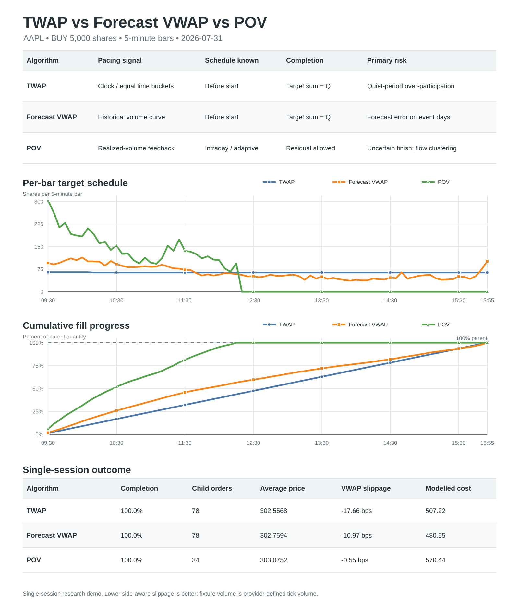
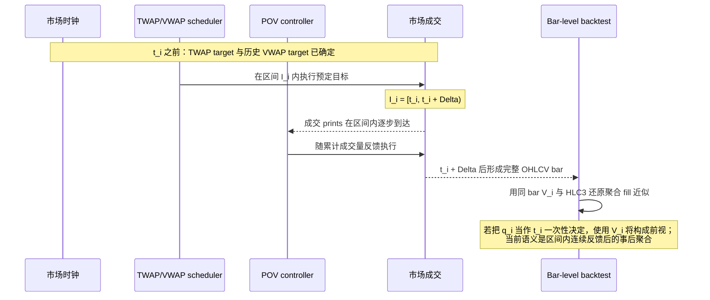

# TWAP / VWAP / POV Execution Lab — Proposal

> 版本：Current implementation summary（包含 Review v1）
>
> 更新日期：2026-08-26
>
> 视角：Delta One execution desk
> 范围：总结当前仓库顶层 Python 实现；不是生产交易系统设计书，也不构成投资建议。

## 1. Executive summary

本项目把输入仓库中的轻量拆单思路和执行/回测结构整合成一个无券商依赖的 Python research prototype，完成了以下闭环：

1. 下载或读取 AAPL 日内 OHLCV，统一时间戳并筛选美股正常交易时段；
2. 用 6 个完整 5 分钟交易日构造可离线复现的数据集；
3. 用前 5 日估计 VWAP 日内成交量曲线，最后 1 日做测试；
4. 生成 TWAP、VWAP 和动态 POV 的整数子单目标；
5. 施加 bar participation hard cap、未成交量滚动、spread、平方根冲击和费用；
6. 输出 completion、arrival shortfall、VWAP slippage 和模型成本；
7. 用 7 个测试覆盖输入校验、总量守恒、POV 未完成语义、时间槽 profile、买卖方向和端到端回测。

当前离线样本为 AAPL 5 分钟数据，日期是 2026-07-24、07-27、07-28、07-29、07-30、07-31，每日 78 根，共 468 根。训练集是前 390 根，测试集是 2026-07-31 的 78 根。默认母订单为 BUY 5,000 股，POV rate 为 10%，bar hard cap 为 20%。

需要特别强调：公开 fixture 的 `volume` 由其提供方描述为 tick volume，并非 consolidated share volume。因此当前 POV/impact 数值用于验证软件行为，不具有严格的股数参与率经济含义。

## 2. 交付物与职责边界

| 文件 | 职责 | 明确不负责 |
|---|---|---|
| `Data_example/data_fetching.py` | Yahoo chart API 下载；CSV 离线读取；UTC/纽约时区处理；正常时段过滤；session/slot 标注；pickle 落盘 | 交易所日历、公司行为复权、行情质量修订、授权管理 |
| `Data_example/AAPL_5m_source.csv` | 当前 pickle 的可审计离线原始输入 | 生产级 consolidated feed |
| `Data_example/example.pkl` | schema v1 数据集，包含 metadata 和 468 根 bar | 不可信 pickle 的安全反序列化 |
| `algo_exec.py` | TWAP/VWAP/POV、largest-remainder、train/test、成交模拟、TCA 和 CLI | broker routing、订单状态机、venue selection、真实 fill prediction |
| `Data_example/backtest_results.json` | 固定配置与回测摘要 | 统计显著性、策略收益或最优算法证明 |
| `tests/test_algo_exec.py` | 核心边界、不变量和端到端验证 | 数据供应商 SLA、真实市场微观结构验证 |

### 2.1 三算法 presentation table

| 维度 | TWAP | Forecast-Profile VWAP | POV |
|---|---|---|---|
| 节奏驱动 | 时钟；每个时间桶等权 | 测试日前估计的历史日内 volume profile | 当日逐步观察到的 realized market volume |
| 核心目标 | \(q_i\approx Q/N\) | \(q_i\approx Qp_i^{forecast}\) | \(q_i\le rV_i^{realized}\) |
| Schedule 何时可知 | 开始前全部可知 | 开始前全部可知 | 交易过程中动态形成 |
| 对实际 volume 的响应 | target 不响应；仅 fill cap 响应 | target 不响应 forecast error；仅 fill cap 响应 | 直接随 realized volume 加减速 |
| 完成语义 | target 总和严格等于 \(Q\) | target 总和严格等于 \(Q\) | 窗口量不足时允许 residual |
| 主要优点 | 简单、透明、可审计 | 把交易集中到历史上更活跃的时段 | participation constraint 清晰、能跟随放量 |
| 主要风险 | 清淡时段 participation 过高 | event/regime change 导致 profile error | 完成时间不确定，放量时成交可能集中 |
| 适用场景 | 基准算法、短窗口、缺少可靠 volume forecast | 日内 volume curve 稳定且以 VWAP 为 benchmark | 客户更关心参与率、订单完成时间可浮动 |

### 2.2 Presentation figure

下图在同一页内对比三种算法的节奏信号、目标 schedule、累计完成路径和单日回测结果。图中母订单 `Target Q = 5,000 shares`；Forecast VWAP 使用前 5 日估计的 profile，POV 使用测试日逐步实现的成交量反馈。



可用于 slides/文档的文件：[`SVG`](figures/twap_vwap_pov_comparison.svg) · [`PNG`](figures/twap_vwap_pov_comparison.png)。可复现生成脚本为 [`figures/generate_algo_comparison.py`](figures/generate_algo_comparison.py)。

### 2.3 Dynamic-Q rolling comparison

为了在 60 分钟 rolling windows 中比较相同的相对订单难度，README 的分布和 regime 图不再固定使用 5,000 股，而是对每个窗口 $w$ 设置：

$$
Q_w=\left\lfloor 0.03\sum_{t\in w}V_t\right\rfloor.
$$

当前主比较固定使用前 5 日训练、最后 1 日测试，共 23 个重叠窗口；$Q_w$ 范围为 170–734，中位数为 315。Forecast VWAP 相对 TWAP 的 mean ΔIS 为 +1.14 bps、win rate 为 26.1%；滞后一根 bar 的 POV 为 -2.52 bps、win rate 为 52.2%。三种算法在 3% Q 下均完成；另输出 6 个非重叠窗口和 3%–15% 完成率敏感性。图与明细分别位于 [`figures/readme/`](figures/readme/) 和 [`rolling_window_results.csv`](figures/readme/rolling_window_results.csv)。

这里使用完整 realized window volume 只是 ex-post research normalization，不能解释为交易开始前已知的母订单。实盘应改用 forecast window volume、ADV 或客户给定的 $Q$。此外当前 volume 是 provider-defined tick volume，3% 不是严格的 consolidated-share participation。

## 3. 端到端数据流

```mermaid
flowchart TD
    A[Yahoo chart API<br/>或离线 OHLCV CSV] -->|原始 timestamp + OHLCV| B[解析与字段校验]
    B -->|timestamp 统一为 UTC| C[转换到 America/New_York]
    C -->|按 bar 开始时刻筛选<br/>local time 属于 [09:30, 16:00)| D[生成 session 与 HH:MM slot]
    D -->|每 session 至少达到<br/>理论 bar 数的 90%| E[选择最近 6 个可用 session]
    E -->|按 UTC timestamp 排序| F[example.pkl schema v1]
    F --> G[load_dataset 再校验并按 UTC 排序]
    G --> H{按 local session date 切分}
    H -->|所有早于 d* 的 session| I[训练集 D_train]
    H -->|最后 session d*| J[测试日 78 个 bar]
    I -->|同一 HH:MM slot<br/>日内 volume share 中位数| K[历史 VWAP profile]
    J -->|N = 测试日 bar 数| L[TWAP 等时间权重]
    K -->|按测试日 slot 对齐| M[VWAP 预测权重]
    J -->|前一 bar 已实现 volume<br/>一根 bar 滞后反馈| N[POV 动态目标]
    L --> O[largest-remainder 整数拆单]
    M --> O
    N --> P[POV 整数 cap]
    O --> Q[按 index i 对齐到测试 bar i]
    P --> Q
    J --> Q
    Q -->|carry-forward + 20% bar volume hard cap| R[模拟 child fills]
    R -->|bar VWAP 或 HLC3 fallback<br/>+ spread + sqrt impact + fee| S[TCA 指标]
    S --> T[backtest_results.json]
```

数据流中存在三类不同的信息时间：

- **交易前已知**：母订单参数、TWAP 权重、仅用历史日生成的 VWAP profile；
- **区间内逐步观察**：POV 所依赖的市场成交量；
- **区间结束后才完整可知**：整根 bar 的 OHLCV、HLC3、当日 market VWAP 和最终 TCA。

这三类信息不能互换。当前回测对 TWAP/VWAP 的 schedule 做了严格的训练日/测试日隔离；POV scheduler 只使用前一根已完成 bar 的 volume，fill price 则仍是 bar-level execution aggregation。

## 4. 时间轴、bar 语义与信息可得性

令 5 分钟间隔为 \(\Delta=5\text{ min}\)，测试日第 \(i\) 根 bar 的开始时刻为 \(t_i\)，覆盖区间为：

$$
I_i=[t_i,t_i+\Delta), \qquad i=1,\ldots,N.
$$

当前数据把 timestamp 解释为 bar open timestamp。完整的 \(O_i,H_i,L_i,C_i,V_i\) 只有在 \(t_i+\Delta\) 后才确定。



### 4.1 每一步的具体时间对齐规则

| 步骤 | 对齐键与规则 | 在何时可知 | 实现含义/风险 |
|---|---|---|---|
| Timestamp parse | ISO-8601 有 offset 时按其 offset 解析；无时区 timestamp 被假设为 UTC；最终统一保存为 UTC | 数据到达时 | 无时区输入若实际不是 UTC，会整体错位；代码不会猜测供应商本地时区 |
| Exchange conversion | 每个 UTC timestamp 转为 `America/New_York`，由 `zoneinfo` 处理 DST | 数据到达时 | session/slot 由纽约当地时间决定，不直接用固定 UTC 时段 |
| Regular-hours filter | 使用 bar **开始时刻**，保留 \(09{:}30 \le t_i^{NY} < 16{:}00\) | 数据清洗时 | 5 分钟最后一根为 15:55，覆盖到 16:00；盘前盘后排除 |
| Session label | `session = local calendar date` | 数据清洗时 | 跨 UTC 日期时仍按交易所当地日期归属 |
| Slot label | `slot = local HH:MM`，不包含日期 | 数据清洗时 | 09:30 只与其他历史日 09:30 对齐；DST 后 UTC 时刻可变但 local slot 不变 |
| Completeness | 理论数量 \(N_{exp}=\lfloor390/\Delta_{min}\rfloor\)；保留 bar 数至少 \(\lceil0.9N_{exp}\rceil\) 的 session | 清洗完某日后 | 当前 5m 样本要求至少 71/78，实际 6 日均为 78；不是正式 exchange calendar 判定 |
| Dataset selection | 按 ISO local date 升序排序后取最近 `sessions=6` 个可用日 | 全部输入清洗后 | 半日市没有专门规则；若达到 90% 阈值失败则被排除 |
| Load ordering | 反序列化后按 UTC timestamp 全局升序 | 回测开始前 | 算法依赖该排序把 schedule index \(i\) 与测试 bar index \(i\) 一一对应 |
| Train/test split | 最大 local session date 为 \(d^*\)；\(d<d^*\) 全部进训练，\(d=d^*\) 全部进测试 | 回测开始前 | 当前是 5 日 train、1 日 test；不会把测试日 volume 用于 VWAP profile |
| VWAP profile | 对每个 local `HH:MM` slot，只聚合训练日相同 slot | 测试日前 | 任何训练 session 缺目标 slot 时直接报错，避免静默扭曲 profile |
| TWAP target | 第 \(i\) 个整数 target 对齐测试日第 \(i\) 个 bar | \(t_1\) 前即可 | 不使用测试日价格或成交量生成 target |
| VWAP target | 第 \(i\) 个 profile 权重按测试日第 \(i\) 个 bar 的 local slot 映射 | \(t_1\) 前即可 | target_records 只提供 slot 网格；其测试日 volume 不进入 profile 计算 |
| POV target | 第 \(i\) 个 target 使用已完成 bar \(i-1\) 的 realized \(V_{i-1}\) | \(t_i\) 时已知 | 默认一根 bar 滞后，首 bar target 为 0；`lag_bars=0` 仅用于非因果诊断 |
| Carry and liquidity | target \(i\) 先加入 carry，再用同 bar \(V_i\) 的 hard cap 决定 fill \(x_i\) | 区间内/区间末聚合 | 未成交 target 滚入后续 bar；这是容量约束模拟，不是逐笔排队模拟 |
| Reference price | 优先使用同 bar `bar_vwap`；缺失时 \(P_i^{ref}=(H_i+L_i+C_i)/3\) | \(t_i+\Delta\) 后 | 是整段执行均价 proxy，不是 bar open 时可交易的已知价格 |
| Arrival | 测试日第一根 bar 的 \(O_1\) | \(t_1\) 附近 | 用作母订单 arrival benchmark；未模拟 arrival quote spread |
| Market VWAP | 测试日所有 bar 的 \(P_i^{ref}V_i\) 汇总 | 测试窗口结束后 | 是事后 benchmark，不是 schedule 输入 |
| Metrics | 所有 fills 和 benchmark 完整后计算 | 测试窗口结束后 | side-aware，数值越低代表成本越低；单日不能用于统计排名 |

## 5. 数学符号与变量定义

### 5.1 索引、集合和行情变量

| 符号 | 定义 | 单位/范围 |
|---|---|---|
| \(d\) | 交易所当地 session date | 日期 |
| \(d^*\) | 测试集最后一个 session date | 当前为 2026-07-31 |
| \(\mathcal D_{train}\) | 所有早于 \(d^*\) 的训练日集合 | 当前 5 日 |
| \(i\) | 日内 bar/时间槽索引 | \(i\in\{1,\ldots,N\}\) |
| \(N\) | 测试日 bar 数 | 当前 \(N=78\) |
| \(t_i\) | bar \(i\) 的 UTC open timestamp | timezone-aware datetime |
| \(s_i\) | bar \(i\) 的纽约当地 `HH:MM` slot | 如 09:30 |
| \(O_{d,i},H_{d,i},L_{d,i},C_{d,i}\) | bar OHLC | price/share |
| \(V_{d,i}\) | provider 报告的 bar volume | provider-defined；当前 fixture 是 tick volume |
| \(P_{d,i}^{ref}\) | bar 参考价 \((H+L+C)/3\) | price/share |

### 5.2 母订单和执行参数

| 符号 | 代码参数 | 定义 | 当前默认值 |
|---|---|---|---:|
| \(Q\) | `total_qty` | 母订单绝对数量 | 5,000 |
| \(\ell\) | `lot_size` | 最小数量增量 | 1 |
| \(U=Q/\ell\) | — | 母订单 lot unit 数 | 5,000 |
| \(\sigma\) | `side.sign` | BUY 为 \(+1\)，SELL 为 \(-1\) | +1 |
| \(r\) | `pov_rate` | POV 目标参与率 | 0.10 |
| \(r_{max}\) | `max_participation_rate` | 所有算法的 bar hard cap | 0.20 |
| \(h\) | `half_spread_bps` | 单边 spread 成本 | 0.50 bps |
| \(\kappa\) | `impact_coefficient_bps` | 平方根冲击系数 | 10.0 bps |
| \(f\) | `fee_per_share` | 每执行单位费用 | 0.0035 |
| \(q_i^{target}\) | schedule element | bar \(i\) 新增目标量 | 非负、lot-aligned integer |
| \(x_i\) | simulated fill | bar \(i\) 实际模拟成交量 | 非负、lot-aligned integer |

代码要求 \(Q\ge0\)、\(\ell\in\mathbb N_+\) 且 \(Q\bmod \ell=0\)。完整回测进一步要求 \(Q>0\)。所有权重必须有限、非负且总和为正；所有 volume 必须有限且非负。

## 6. 通用整数分配：largest-remainder

TWAP 和 VWAP 先得到非负权重 \(w_i\)，再用相同的整数分配器。令：

$$
a_i=U\frac{w_i}{\sum_{j=1}^{N}w_j},\qquad
b_i=\lfloor a_i\rfloor,
$$

$$
R=U-\sum_{i=1}^{N}b_i.
$$

取小数余数 \(a_i-b_i\) 最大的 \(R\) 个索引组成集合 \(\mathcal I_R\)。相同余数按较早 index 优先。最终：

$$
u_i=b_i+\mathbf 1_{\{i\in\mathcal I_R\}},\qquad
q_i^{target}=\ell u_i.
$$

因此满足以下不变量：

$$
q_i^{target}\in\{0,\ell,2\ell,\ldots\},\qquad
q_i^{target}\ge0,\qquad
\sum_{i=1}^{N}q_i^{target}=Q.
$$

largest-remainder 解决的是离散化误差；它不解决 volume forecast error、市场冲击或完成风险。

## 7. TWAP

### 7.1 目标

在指定窗口内让目标成交速率对时间近似恒定，不依赖测试日成交量预测。

### 7.2 权重和 schedule

TWAP 对所有时间桶设：

$$
w_i^{TWAP}=1,\qquad i=1,\ldots,N.
$$

连续解为：

$$
\bar q_i^{TWAP}=\frac{Q}{N}.
$$

实际整数 \(q_i^{TWAP}\) 由第 6 节的 largest-remainder 给出。因此当 \(Q\) 不能被 \(N\) 整除时，较早桶只会因确定性的 tie-break 多得到至多一个 lot。

### 7.3 时间对齐

测试日有多少根 bar 就生成多少个 target；`schedule[i]` 与排序后的 `test_records[i]` 对齐。schedule 在测试开始前完全可知，不读取 \(O_i,H_i,L_i,C_i,V_i\)。但模拟 fill 仍受同 bar realized volume hard cap 约束。

## 8. VWAP

### 8.1 历史日内 volume share

对每个训练日 \(d\in\mathcal D_{train}\)，先计算当日总量：

$$
V_d^{day}=\sum_{j\in\mathcal I_d}V_{d,j}.
$$

仅当 \(V_d^{day}>0\) 时，该日进入 profile 计算。该日 slot \(s_i\) 的归一化 share 为：

$$
S_{d,i}=\frac{V_{d,i}}{V_d^{day}}.
$$

### 8.2 跨日 robust aggregation

令 \(\mathcal D_i\subseteq\mathcal D_{train}\) 为包含目标 slot \(s_i\) 的训练日集合。未经最终归一化的 slot 权重为：

$$
m_i=\operatorname{median}_{d\in\mathcal D_i}S_{d,i}.
$$

若没有历史日覆盖 slot \(s_i\)，代码定义 \(m_i=0\)。因为逐 slot 中位数一般不严格加总为 1，最终 profile 再归一化：

$$
p_i=\frac{m_i}{\sum_{j=1}^{N}m_j},\qquad
\sum_{i=1}^{N}p_i=1.
$$

VWAP 设置 \(w_i^{VWAP}=p_i\)，再用 largest-remainder 得到整数 \(q_i^{VWAP}\)。

### 8.3 时间对齐与无泄漏边界

- profile 的分子和分母都只使用 \(d<d^*\) 的训练日 volume；
- 测试记录只提供目标 slot 网格 \(s_1,\ldots,s_N\)，测试日 \(V_{d^*,i}\) 不进入 \(p_i\)；
- 测试日 realized volume 只在成交容量和事后 market VWAP 中使用；
- 当前只有 5 个训练日，没有 weekday、event day 或 regime conditioning。

这里的“VWAP”指 **按预测 volume curve 执行的 schedule**。事后 benchmark market VWAP 是另一个量，定义见第 11 节。

## 9. POV

### 9.1 动态目标

给定目标参与率 \(r\in(0,1]\)，bar \(i\) 基于外生市场量的 lot-aligned 容量为：

$$
c_i^{POV}=\ell\left\lfloor\frac{rV_{i-1}}{\ell}\right\rfloor,
\qquad c_1^{POV}=0.
$$

令执行 bar \(i\) 前的母订单剩余量为：

$$
R_i^-=Q-\sum_{j=1}^{i-1}q_j^{POV}.
$$

POV target 为：

$$
q_i^{POV}=\min(c_i^{POV},R_i^-).
$$

若累计市场量不足，则：

$$
\sum_{i=1}^{N}q_i^{POV}<Q,
$$

剩余订单不会在收盘被代码强制补齐。这是与 TWAP/VWAP 总量守恒 schedule 的关键差异。

### 9.2 时间语义

公式中的 \(V_{i-1}\) 在 \(t_i\) 已完整实现，因此默认 scheduler 满足 bar-level causality。真实 POV controller 会随 prints 更高频更新，代码的一根 bar 滞后仍是粗糙近似；当前数据没有 intrabar prints，无法验证 feedback path、feed latency 或 participation denominator 是否包含自身成交。

## 10. Liquidity cap、carry-forward 与模拟成交

算法 schedule 和实际模拟 fill 是两个不同对象。令 bar \(i\) 开始处理前的未成交 target carry 为 \(C_{i-1}\)，初始 \(C_0=0\)。加入本 bar 新 target 后：

$$
\widetilde C_i=C_{i-1}+q_i^{target}.
$$

通用 hard cap 为：

$$
K_i=\ell\left\lfloor\frac{r_{max}V_i}{\ell}\right\rfloor.
$$

令此前累计模拟成交为 \(X_{i-1}=\sum_{j<i}x_j\)，则本 bar 尚未完成的母订单量为 \(Q-X_{i-1}\)。模拟 fill：

$$
x_i=\min\left(\widetilde C_i,K_i,Q-X_{i-1}\right).
$$

下一 bar carry：

$$
C_i=\widetilde C_i-x_i.
$$

由此得到：

$$
0\le x_i\le K_i,\qquad
\sum_i x_i\le Q.
$$

对 TWAP/VWAP，\(\sum_iq_i^{target}=Q\)，未完成通常来自窗口结束时仍有 carry。对 POV，除了 carry 外还可能存在尚未被 participation rule 调度的母订单，因此最终 `remaining_qty` 不必等于最终 carry。

实际 bar participation 定义为：

$$
\rho_i=
\begin{cases}
x_i/V_i,&V_i>0,\\
0,&V_i=0.
\end{cases}
$$

当 \(V_i=0\) 时 \(K_i=0\)，所以代码不会在零量 bar 生成 fill。

## 11. 成交价格与成本模型

### 11.1 Bar reference price

$$
P_i^{ref}=\frac{H_i+L_i+C_i^{price}}{3}.
$$

这里用 \(C_i^{price}\) 表示 close price，避免与上一节 carry \(C_i\) 混淆。HLC3 是区间代理价，不是可执行 quote。

### 11.2 Spread 和 market impact

平方根冲击（bps）为：

$$
g_i=\kappa\sqrt{\rho_i}.
$$

总 adverse move（不含 fee）为：

$$
d_i=h+g_i.
$$

side-aware fill price 为：

$$
P_i^{fill}=P_i^{ref}\left(1+\sigma\frac{d_i}{10{,}000}\right),
$$

其中 BUY 的 \(\sigma=+1\)，SELL 的 \(\sigma=-1\)。因此模型保证 buy fill 高于 reference，sell fill 低于 reference。

### 11.3 美元成本分解

$$
Cost_i^{spread}=x_iP_i^{ref}\frac{h}{10{,}000},
$$

$$
Cost_i^{impact}=x_iP_i^{ref}\frac{g_i}{10{,}000},
$$

$$
Cost_i^{fee}=fx_i.
$$

项目报告的 `total_modelled_cost` 为：

$$
Cost^{model}=\sum_i\left(Cost_i^{spread}+Cost_i^{impact}+Cost_i^{fee}\right).
$$

它不包含等待期间的市场价格变化，也不等于 implementation shortfall dollars。

## 12. TCA 指标

令总模拟成交量：

$$
X=\sum_{i=1}^{N}x_i.
$$

代码要求至少有一个 fill，因此 \(X>0\)。成交均价：

$$
P^{exec}=\frac{\sum_i x_iP_i^{fill}}{X}.
$$

Arrival price：

$$
P^{arrival}=O_1.
$$

事后 market VWAP benchmark：

$$
P^{mktVWAP}=\frac{\sum_iP_i^{ref}V_i}{\sum_iV_i}.
$$

总费用为 \(F=fX\)。arrival 指标按 arrival notional、VWAP 指标按 market-VWAP notional 归一化：

$$
FeeBps=10{,}000\frac{F}{P^{arrival}X}.
$$

Side-aware arrival shortfall：

$$
IS_{bps}=10{,}000\sigma\frac{P^{exec}-P^{arrival}}{P^{arrival}}+FeeBps.
$$

Side-aware VWAP slippage：

$$
VWAPSlip_{bps}=10{,}000\sigma\frac{P^{exec}-P^{mktVWAP}}{P^{mktVWAP}}
+10{,}000\frac{F}{P^{mktVWAP}X}.
$$

代码还分别输出不含费用的 `arrival_price_shortfall_bps` 和 `vwap_price_slippage_bps`，便于把 gross price performance 与显式费用分开。

完成率和剩余量：

$$
Completion=\frac{X}{Q},\qquad Remaining=Q-X.
$$

所有 side-aware cost 指标都是越低越好。负的 arrival shortfall 表示在忽略机会成本和未完成处罚的当前定义下，成交方向相对 arrival 有利；它不代表执行算法创造了 alpha。

## 13. 固定样本回测结果

配置：AAPL、2026-07-31、BUY、\(Q=5{,}000\)、\(r=10\%\)、\(r_{max}=20\%\)、\(h=0.5\) bps、\(\kappa=10\) bps、\(f=0.0035\)。

| Algo | Executed | Completion | Child orders | Avg execution | Arrival shortfall | VWAP slippage | Modelled cost |
|---|---:|---:|---:|---:|---:|---:|---:|
| TWAP | 5,000 | 100.0% | 78 | 302.5568 | -929.09 bps | -17.66 bps | 507.22 |
| VWAP | 5,000 | 100.0% | 78 | 302.7594 | -923.01 bps | -10.97 bps | 480.55 |
| POV | 5,000 | 100.0% | 34 | 302.4696 | -931.70 bps | -20.52 bps | 583.87 |

共同 benchmark：

$$
P^{arrival}=333.55,\qquad P^{mktVWAP}=303.095142.
$$

测试日价格相对 arrival 大幅下跌，所以 BUY 的 arrival shortfall 主要被市场路径主导。滞后 POV 在这个单日样本上的成交价最低，Forecast VWAP 的简化模型成本最低；由于只有一个测试日且 volume 口径有限，这些结果不能用来证明算法优劣。

## 14. 已验证的不变量

当前 `python -m pytest -q` 结果为 `12 passed`。测试覆盖还包括因果化 POV、缺失 slot 拒绝、pickle 信任边界、gross/net 指标、非重叠窗口和完成率敏感性。

- TWAP/VWAP largest-remainder 总量守恒；
- lot alignment；
- 空、负、NaN、Inf、overflow profile 拒绝；
- POV 每 bar rate cap 和窗口末 residual；
- VWAP 对每日 normalized share 取中位数；
- liquidity carry-forward；
- BUY/SELL fill price 的 adverse direction；
- 5 日 train、1 日 test 的端到端三算法运行；
- `executed_qty + remaining_qty = requested_qty`；
- fills 合计等于 `executed_qty`。

## 15. Limitations 与 Review v1 结论

### 15.1 数据与时间

1. 当前只有 6 个完整 session、5 个 profile 训练日和 1 个测试日，没有 walk-forward 或统计置信区间。
2. completeness 用 bar count 的 90% heuristic，不使用正式 exchange calendar；半日市、临时休市和停牌没有显式分类。
3. naive timestamp 被直接解释为 UTC；供应商若实际给 local naive time，会造成 session/slot 错位。
4. 当前 volume 是 tick volume。POV 的 target、hard cap 和 impact 都不具备 share-volume 的严格经济解释。

### 15.2 前视和 intrabar 路径

1. 历史 VWAP profile 不使用测试日 volume，schedule 层面没有 train/test leakage。
2. POV scheduler 默认使用前一 bar realized volume；同 bar capacity 和 reference price 仍是区间执行结果的聚合 proxy，而非 bar-open forecast。
3. 缺少 tick/quote event order，无法模拟控制器在 bar 内何时达到 participation target，也无法区分先发生价格移动还是先成交。
4. market VWAP 是事后 benchmark；不得反向用于 schedule。

### 15.3 执行真实性

1. 没有 NBBO、spread path、order book depth、queue position、passive/active choice、venue、auction、odd lot 和 trade correction。
2. 固定 half-spread、平方根冲击和每股 fee 未由真实 fills 校准。
3. hard cap 基于同 bar volume，未建模 market volume feed 延迟、自己的成交是否进入分母以及 venue coverage。
4. 没有 limit price、urgency escalation、收盘 sweep、cancel/replace、reject 或 broker state machine。
5. 未完成订单只报告 residual，没有 terminal penalty 或下一交易日处置逻辑。

### 15.4 指标解释

1. `total_modelled_cost` 只含 spread、impact 和 fee，不含 timing cost。
2. arrival shortfall 会被测试窗口价格趋势主导，不能单独评价 schedule quality。
3. 未完成订单没有 opportunity-cost penalty；不同 completion 的算法不能只按已成交均价比较。
4. 净指标包含显式费用，同时提供不含费用的 gross price 指标；跨研究比较时必须说明采用哪一种口径。

Review v1 的结论是：当前实现适合作为透明、确定性、可测试的算法执行 scaffold；它清楚展示了 schedule、liquidity constraint、fill approximation 和 TCA 的边界。但在更换为口径明确的 share volume、消除 bar-level contemporaneous approximation、引入 quote/order replay 并进行多日 walk-forward 之前，不应将结果用于生产参数选择或算法排名。

## 16. 建议的下一版本

按优先级建议：

1. 使用带 exchange calendar 和 consolidated share volume 的授权数据；
2. 明确 event-time contract：bar-open 决策使用 \(\mathcal F_{t_i}\) 信息，或改为 tick-level continuous POV replay；
3. 将测试日滚动成多日 walk-forward，逐日仅使用此前数据估计 profile；
4. 对未完成量加入 terminal opportunity cost，并报告 completion-adjusted metrics；
5. 使用 quote midpoint/NBBO、spread 和 intrabar volume path 替代 HLC3 proxy；
6. 用真实 desk fills 分标的、时段和 volatility regime 校准 impact；
7. 增加 auction、limit price、urgency/catch-up 和订单状态机。

## 17. 复现命令

```bash
# 从可审计 CSV 离线重建 pickle
python Data_example/data_fetching.py \
  --input-csv Data_example/AAPL_5m_source.csv \
  --source-url https://raw.githubusercontent.com/getdata-finance/aapl-5m-ohlcv-stocks-historical-data/main/AAPL_5m.csv

# 网络可用时刷新 Yahoo 数据
python Data_example/data_fetching.py --symbol AAPL --interval 5m --range 1mo

# 运行回测并输出 JSON
python algo_exec.py \
  --data Data_example/example.pkl \
  --results Data_example/backtest_results.json

# 验证
python -m pytest -q
```
